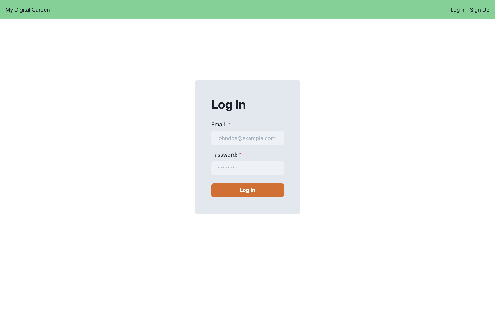
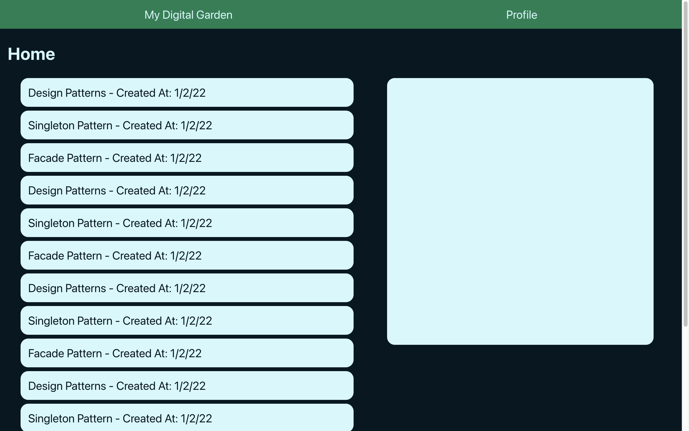
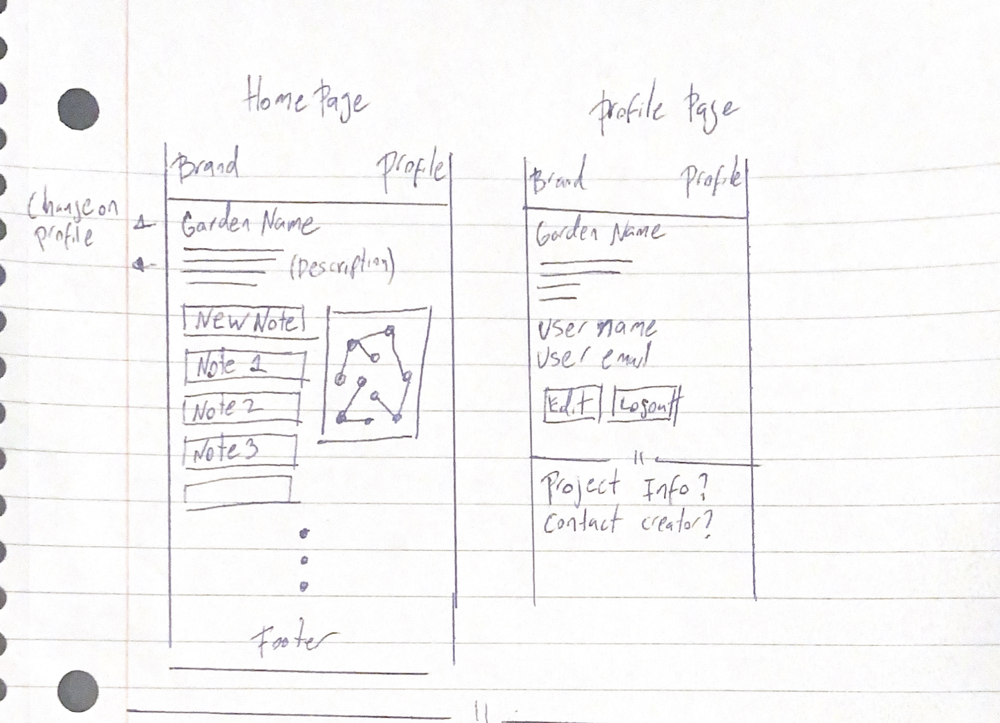
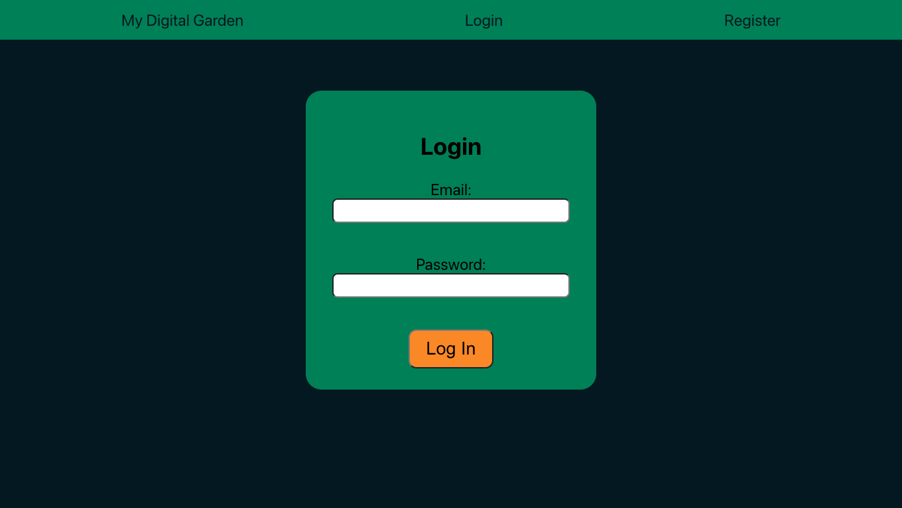
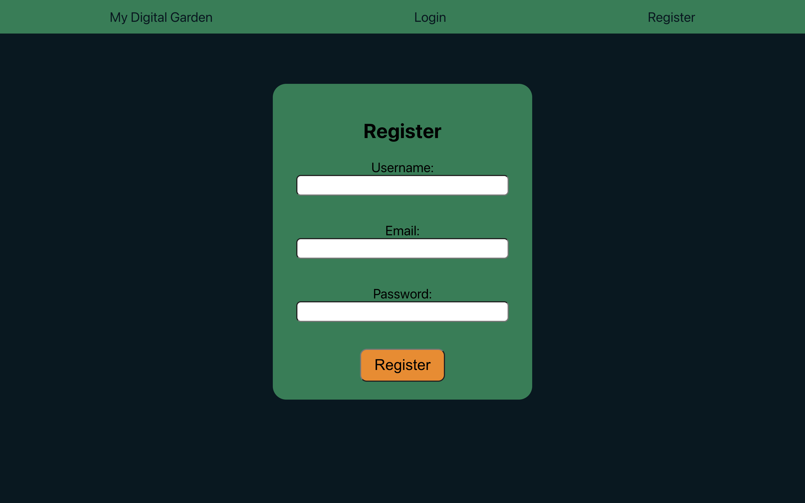
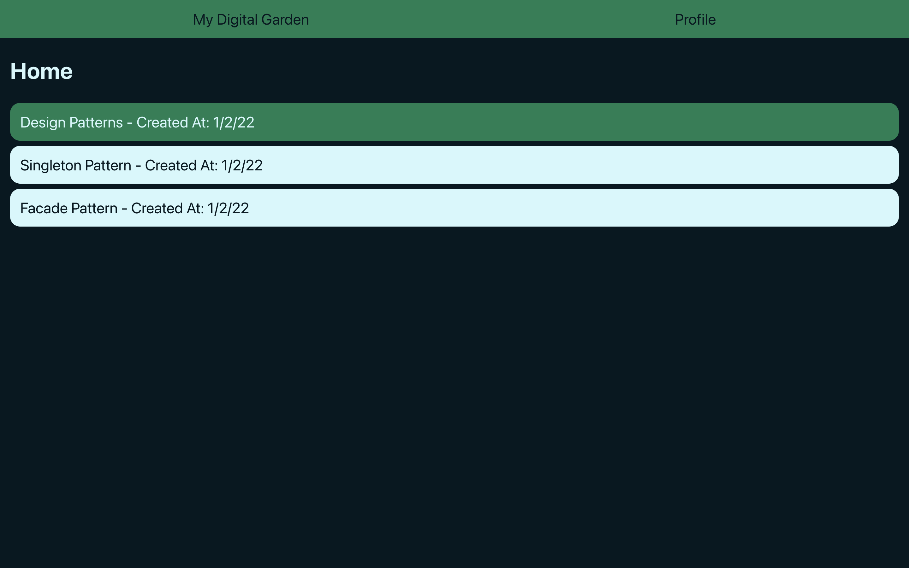

# my-digital-garden

## Overview

This project is a PKM (Personal Knowledge Management) or Zettelkasten App.
The purpose is to be able to create notes or slips or information that you can connect with other notes to create new ideas and find new connections.

It will be put live as soon as the MVP is ready.

## Images

### Pre-MVP

- February 9th 2022

  #### Login after implementing Chakra UI

  

- February 1st 2022

  #### Dashboard with map placeholder

  

- Jan 31st 2022

  #### Wireframe

  

  #### Login Page

  

  #### Register Page

  

  #### Dashboard

  
